# Développement d'un Système d'information (SI) pour la gestion d'entreprise 
### Besoins fonctionnels :
les besoins fonctionnels que Le SI doit satisfaire, nous pouvons les résumer comme suit :
-  L’authentification des utilisateurs
-  La gestion des employés
-  La gestion des stagiaires
-   La gestion des congés
- La gestion des documents (certificat de travail, bulletin de paie)
- La gestion des prêts financiers

<h2>Technologies utilisés dans le projet:</h2>

 ### Languages:
 
  Jakarta EE : pour le bachend 

  ReactJS(framework de JavaScript) et la bibliothèque antd : pour le frontend
  
  CSS et la bibliothèque Bootstrap : pour le style

  ### Design UI/UX:
  
  Utilisation de Figma 

  ### Outils de versionning et collaboration:
  - Git : un logiciel de gestion de versions décentralisé.
  - GITHUB est une plateforme permettant d’héberger et de gérer des projets. 
  Présentée comme la plateforme des développeurs modernes, elle offre la possibilité de gérer ses dépôts Git et ainsi de mieux appréhender la 
gestion des versions des codes sources.
  - Slack est une plate-forme qui permet de faire la communication collaborative propriétaire (SaaS) et un logiciel de gestion de projets

### Services externes :
  - Jira : logiciel pour la gestion des tâches du projet.
  - Axios : pour connecter le backend avec le frontend .

<h2> le projet dans Intellij Idea </h2>
  

<h2>Développement du backend:</h2>
<h3>Architecture des micro-services </h3>
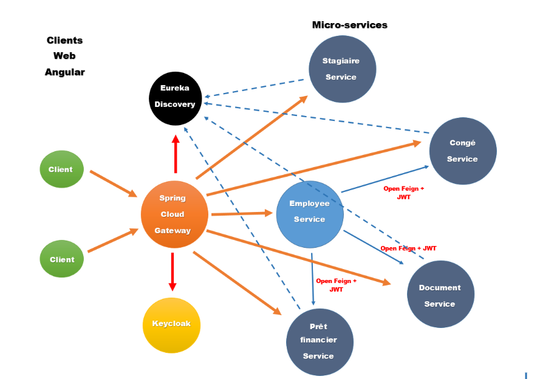  

### Les dépendences de Spring Boot utilisées pour les micro-services :

Pour les getters et les setters: Lombok.

Pour créer une application web spring MVC: Spring Web et Rest Repositories.

Pour le SQL: Spring Data JPA , H2 DATABASE(pour les tests) et puis mySQL driver. 

Pour faire le monitoring des micro-services: Spring Boot Actuator.

Pour créer la docummentation 'swagger' : SpringDoc OpenAPI UI

Pour Spring Cloud Discovery: Eureka Discovery Client.

Pour faire communiquer les micro-services : OpenFeign.

### Les dépendences de Spring Boot utilisées pour Discovery :
Eureka Server et  Spring Boot Actuator

### Les dépendences de Spring Boot utilisées pour Gateway :
Spring Boot Actuator et Eureka Discovery Client

###les micro-services créés:
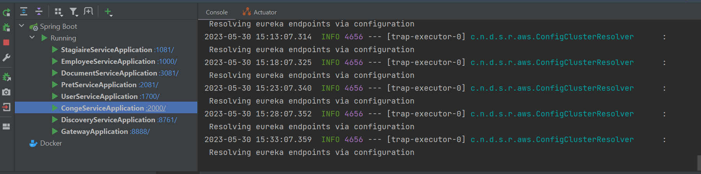  

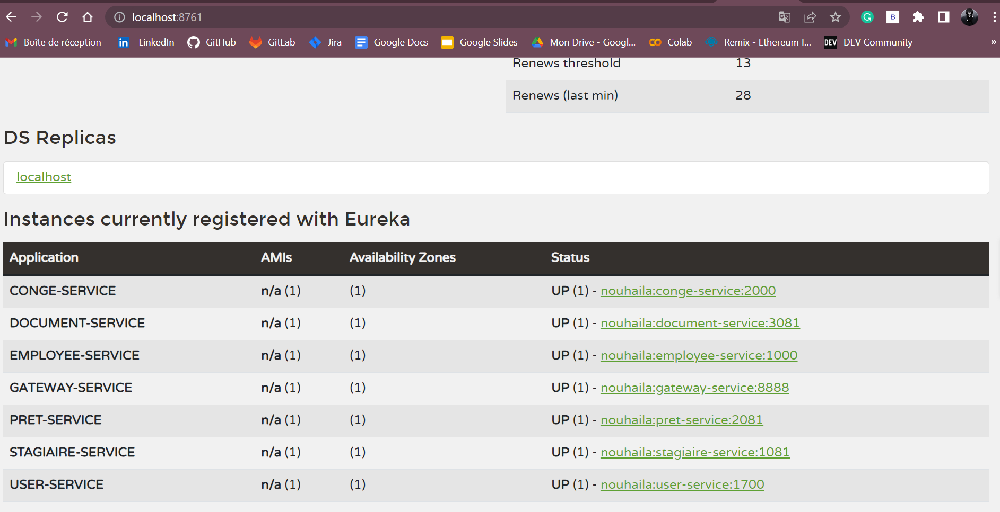  

<h2>Développement du Frontend:(Zoom: 80%)</h2>

### Les composants et les pages créés dans React : 

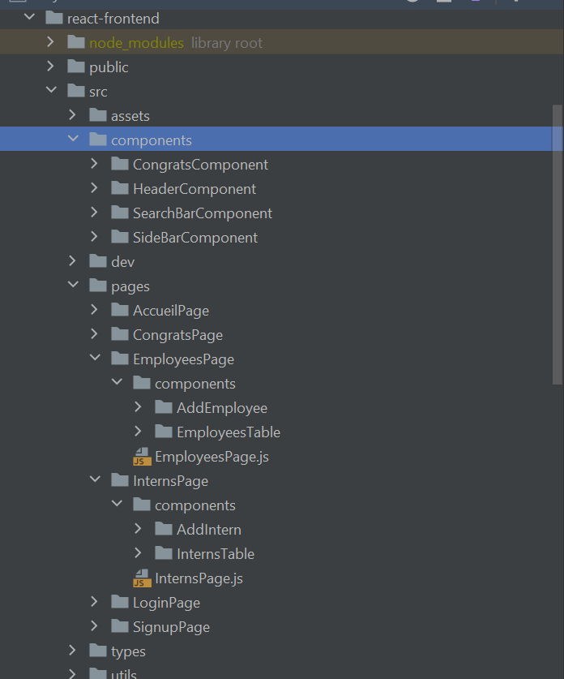  

### Exemples des pages créées: 

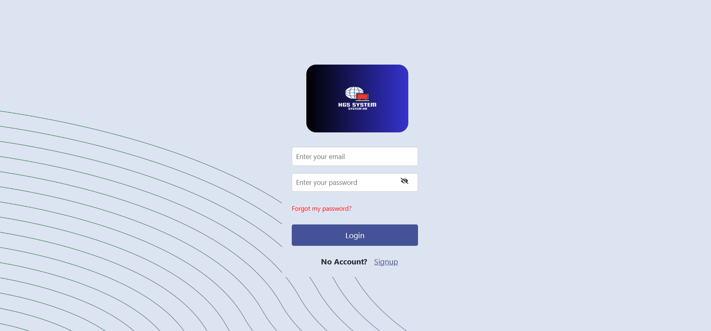  
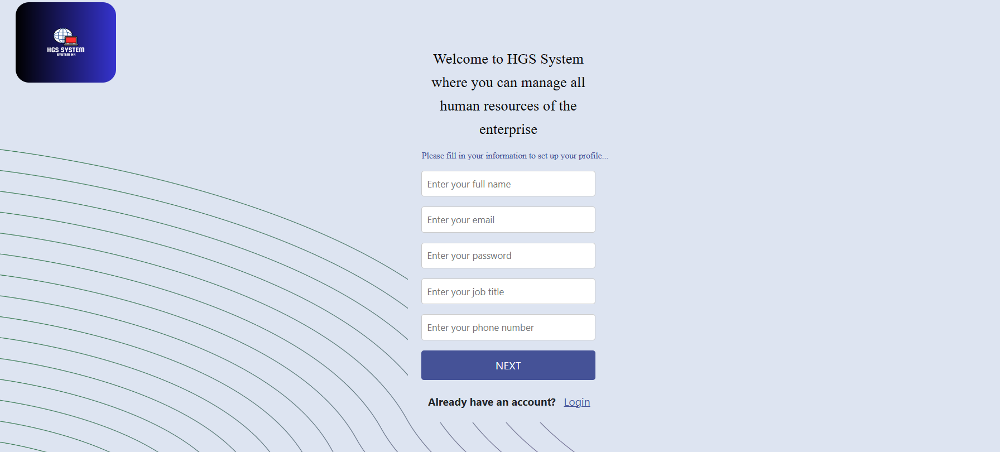  
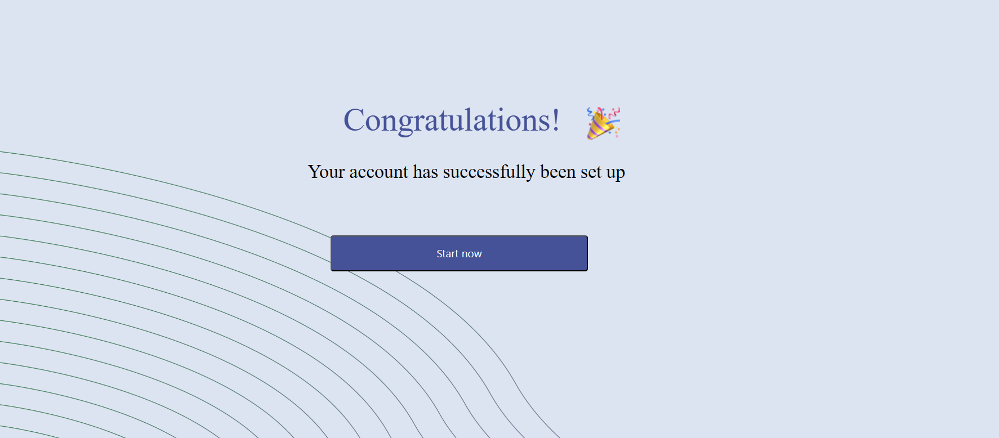  
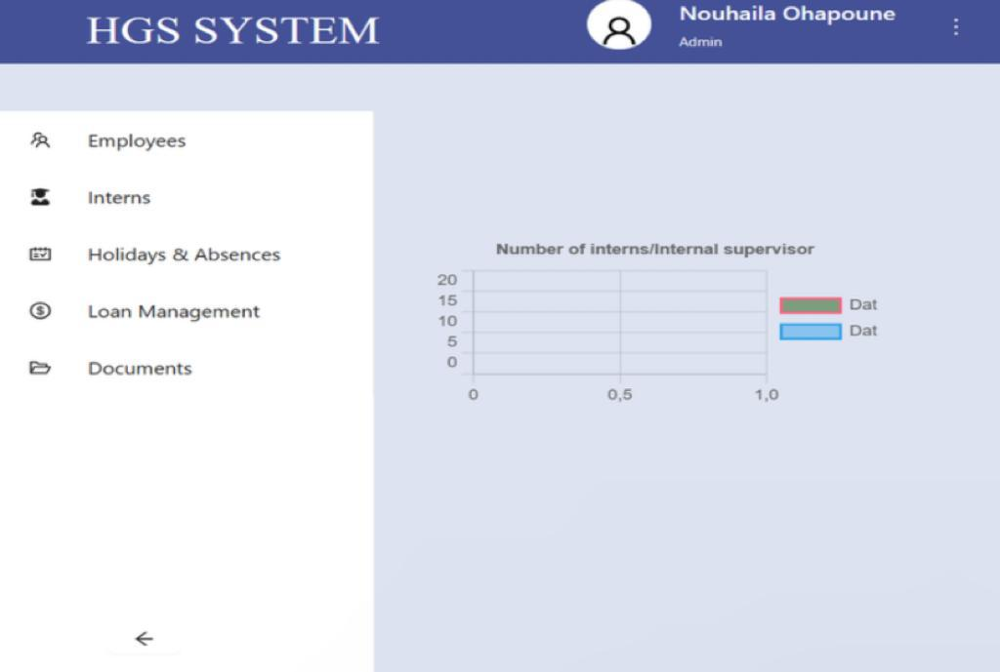  
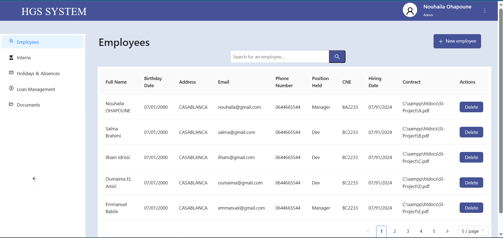  
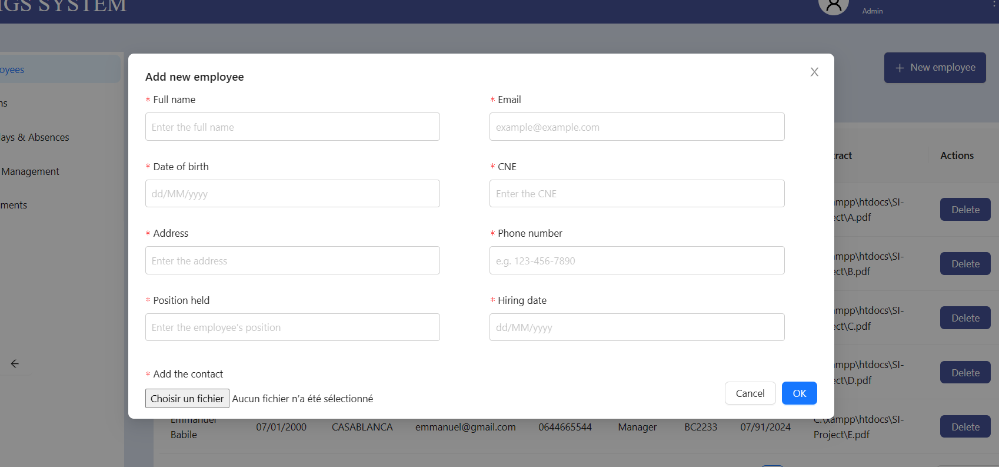  
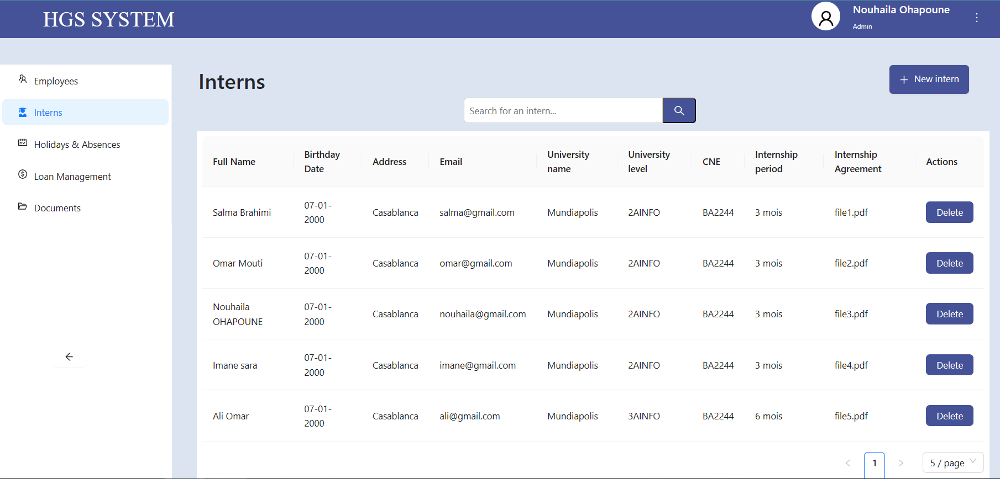  
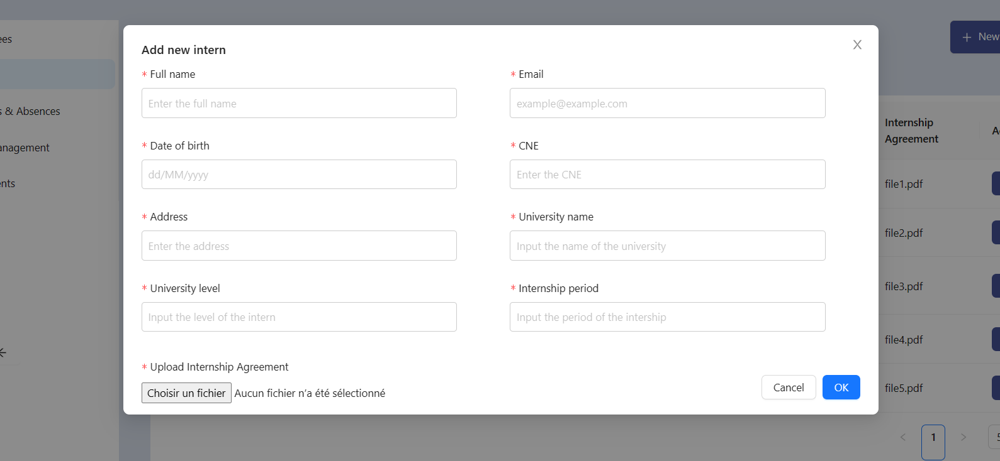  

